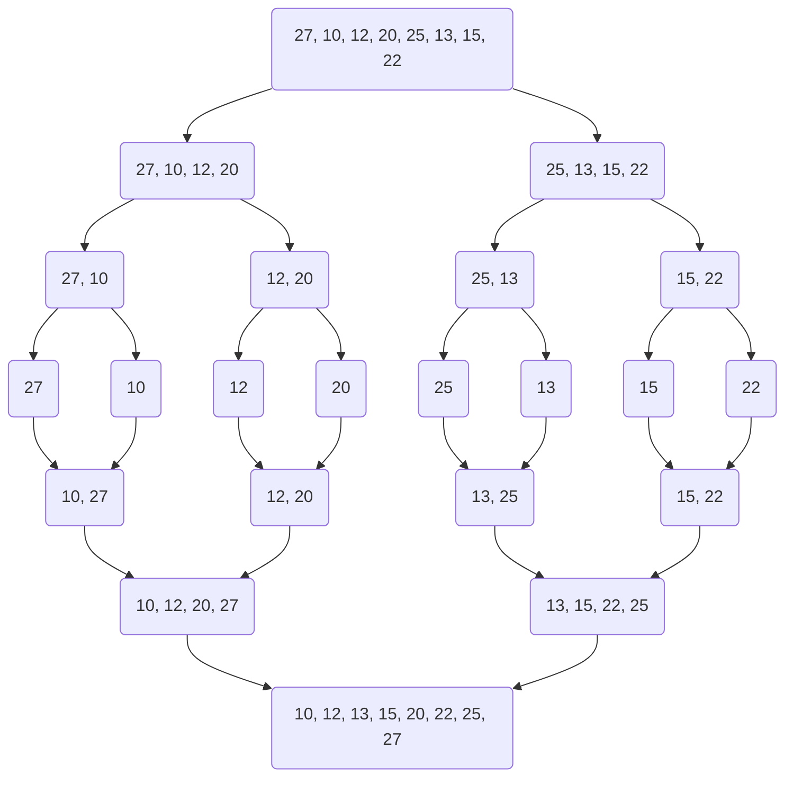
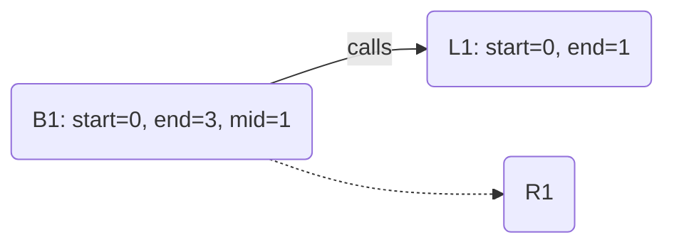
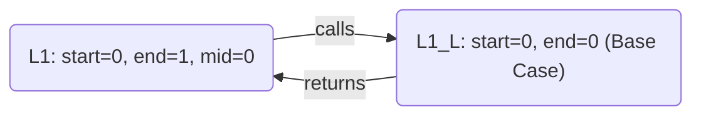
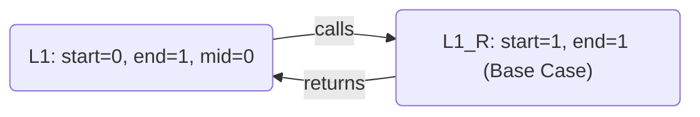
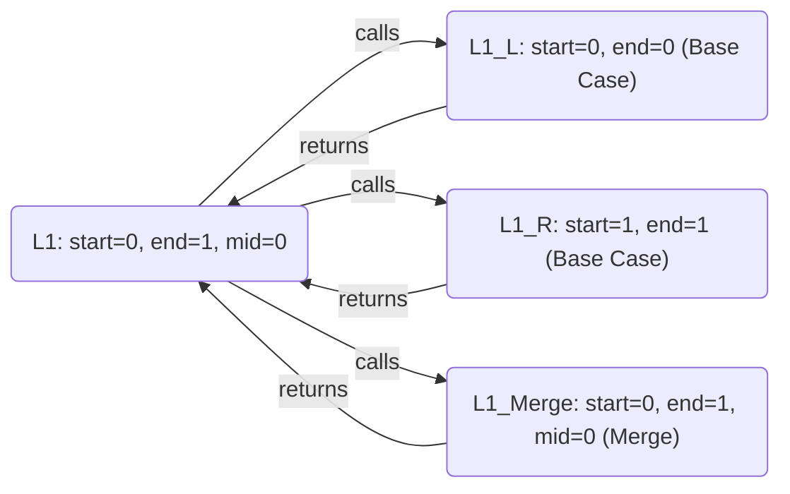
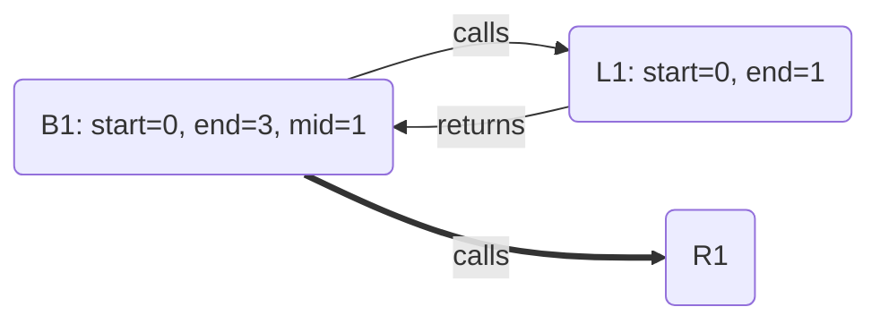
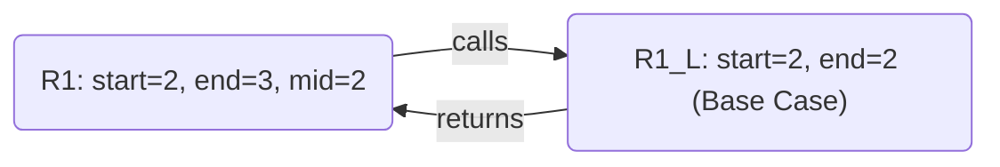
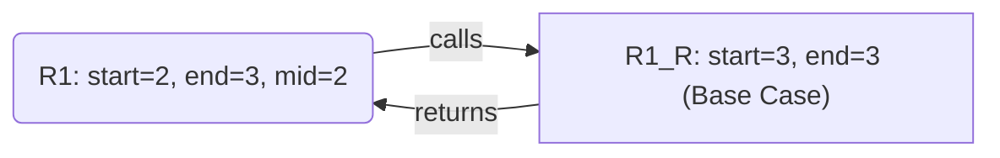
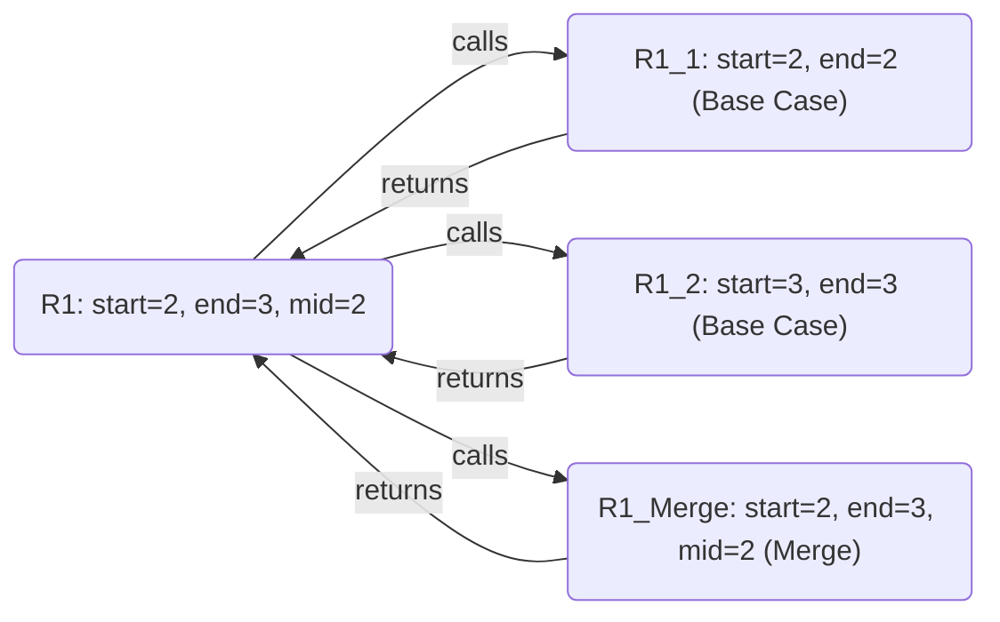
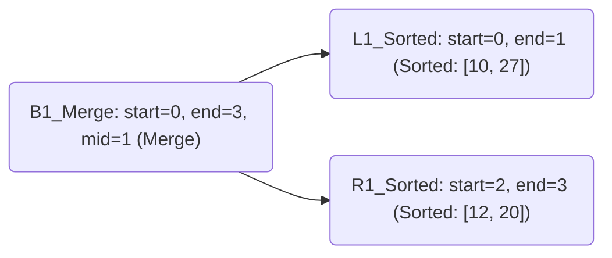

# Understanding Merge Sort
Merge Sort is a **divide and conquer algorithm**. It works by recursively dividing the input array into smaller subarrays, sorting them individually, and then merging the sorted subarrays to produce the final sorted output. It's time complexity of $O(n\log n)$.
## Visual Example


## The Algorithm

```cpp
void mergeSort(std::vector<int> &list, int start, int end) {
	if (start >= end) return ;
	int mid = start + (end - start) / 2;

	mergeSort(list, start, mid);
	mergeSort(list, mid + 1, end);
	merge(list, start, mid, end);
}
```
### Recursion Explanation
Consider the following list:
$$
\begin{aligned}
L &= [27, 10, 12, 20]
\end{aligned}
$$
In the `mergeSort()` function, we are going to pass this list $L$ alongside with the indices for the start and the end of the list.

```cpp
mergeSort(list, 0, arr.size() - 1);
```

In the case of our list $L$, the initial values for `start` and `end` are `0` and `7` respectively.

```cpp
if (start >= end) return ;
int mid = (start + end) / 2;
mergeSort(list, start, mid);
mergeSort(list, mid + 1, end);
merge(list, start, mid, end);
```

Let's go now step by step while keeping track of the variables:

We are going to call this layer as $B1$ (*B* for *base*):

```
start = 0
end = 3
mid = 1
```

```cpp
if (start >= end) return ;
int mid = (start + end) / 2;
> mergeSort(list, start, mid);
mergeSort(list, mid + 1, end);
merge(list, start, mid, end);
```



---

This is the layer that is responsible for sorting the left portion of the original array. Let's call this layer $L1$:

```
start = 0
end = 1
mid = 0
```

```cpp
if (start >= end) return ;
int mid = (start + end) / 2;
> mergeSort(list, start, mid);
mergeSort(list, mid + 1, end);
merge(list, start, mid, end);
```

---

$L1$'s first call for `mergeSort()` immediatly returns as $0 \geq 0$:

```
start = 0
end = 0
```

```cpp
> if (start >= end) return ;
int mid = (start + end) / 2;
mergeSort(list, start, mid);
mergeSort(list, mid + 1, end);
merge(list, start, mid, end);
```



---

Now, we are back to $L1$, it calls `mergeSort()` for the second time:

```
start = 0
end = 1
mid = 0
```

```cpp
if (start >= end) return ;
int mid = (start + end) / 2;
mergeSort(list, start, mid);
> mergeSort(list, mid + 1, end);
merge(list, start, mid, end);
```

---

$L1$'s second call for `mergeSort()` immediatly returns as $1 \geq 1$:

```
start = 1
end = 1
```

```cpp
> if (start >= end) return ;
int mid = (start + end) / 2;
mergeSort(list, start, mid);
mergeSort(list, mid + 1, end);
merge(list, start, mid, end);
```



---

Back to $L1$, the `merge()` function gets called, sorting the left portion of the original list:

```
start = 0
end = 1
mid = 0
```

```cpp
if (start >= end) return ;
int mid = (start + end) / 2;
mergeSort(list, start, mid);
mergeSort(list, mid + 1, end);
> merge(list, start, mid, end);
```



After running `merge()`, the list gets sorted on the first segment:

**List Before:**
$$
\begin{aligned}
L &= [27, 10, 12, 20]
\end{aligned}
$$
**List After:**
$$
\begin{aligned}
L &= [10, 27, 12, 20]
\end{aligned}
$$
---

After merging, $L1$ returns to $B1$ that consequentially calls $R1$:

```
start = 0
end = 3
mid = 1
```

```cpp
if (start >= end) return ;
int mid = (start + end) / 2;
mergeSort(list, start, mid);
> mergeSort(list, mid + 1, end);
merge(list, start, mid, end);
```



---

$R1$ calls `mergeSort()` to sort its left portion:

```
start = 2
end = 3
mid = 2
```

```cpp
if (start >= end) return ;
int mid = (start + end) / 2;
> mergeSort(list, start, mid);
mergeSort(list, mid + 1, end);
merge(list, start, mid, end);
```

---

It immediatly returns as $2 \geq 2$:

```
start = 2
end = 2
```

```cpp
> if (start >= end) return ;
int mid = (start + end) / 2;
mergeSort(list, start, mid);
mergeSort(list, mid + 1, end);
merge(list, start, mid, end);
```



---

$R1$ calls `mergeSort()` to sort its right portion:

```
start = 2
end = 3
mid = 2
```

```cpp
if (start >= end) return ;
int mid = (start + end) / 2;
mergeSort(list, start, mid);
> mergeSort(list, mid + 1, end);
merge(list, start, mid, end);
```

---

It also immediatly returns as $3 \geq 3$:

```
start = 3
end = 3
```

```cpp
> if (start >= end) return ;
int mid = (start + end) / 2;
mergeSort(list, start, mid);
mergeSort(list, mid + 1, end);
merge(list, start, mid, end);
```



---

$R1$ calls `merge()` to sort the right portion of the original list:

```
start = 2
end = 3
mid = 2
```

```cpp
if (start >= end) return ;
int mid = (start + end) / 2;
mergeSort(list, start, mid);
mergeSort(list, mid + 1, end);
> merge(list, start, mid, end);
```



**List Before:**
$$
\begin{aligned}
L &= [10, 27, 12, 20]
\end{aligned}
$$
**List After:**
$$
\begin{aligned}
L &= [10, 27, 12, 20]
\end{aligned}
$$

---

Now, back to $B1$, the `merge()` function gets called:

```
start = 0
end = 3
mid = 1
```

```cpp
if (start >= end) return ;
int mid = (start + end) / 2;
mergeSort(list, start, mid);
mergeSort(list, mid + 1, end);
> merge(list, start, mid, end);
```

The whole list gets sorted.



**List Before:**
$$
\begin{aligned}
L &= [10, 27, 12, 20]
\end{aligned}
$$
**List After:**
$$
\begin{aligned}
L &= [10, 12, 20, 27]
\end{aligned}
$$
## How does the merge function work?
To understand how the `merge()` function works, let's consider the following unsorted list and merge it.

```
start = 0
end = 3
mid = 1
```

$$
\begin{aligned}
L &= [10, 27, 12, 20]
\end{aligned}
$$
First, two vectors are created. The `left` vector contains the values $[10, 27]$, while the `right` vector contains the values $[12, 20]$.

```cpp
std::vector<int> left(list.begin() + start, list.begin() + mid + 1);
std::vector<int> right(list.begin() + mid + 1, list.begin() + end + 1);
```

1. 10 gets compared with 12, as $10 \leq 12$, 10 becomes the first element of the list.
2. `i` gets incremented and 27 gets compared with 12. As $27 \nleq 12$, the `else` block gets executed, inserting 12 into the list and incrementing `j`.
3. Now, 27 gets compared with 20. As $27 \nleq 20$, the `else` block gets executed again, putting 20 into the list and incrementing `j`.

```cpp
while (i < left.size() && j < right.size()) {
	if (left[i] <= right[j])
		list[k++] = left[i++];
	else
		list[k++] = right[j++];
}
```

As, 27 is still remaining outside of the final sorted list, we loop one more time through both lists to make sure the contents of all lists gets inserted:

```cpp
while (i < left.size())
	list[k++] = left[i++];
while (j < right.size())
	list[k++] = right[j++];
```

Complete function:

```cpp
void merge(std::vector<int> &list, int start, int mid, int end) {
	std::vector<int> left(list.begin() + start, list.begin() + mid + 1);
	std::vector<int> right(list.begin() + mid + 1, list.begin() + end + 1);
	int i = 0, j = 0, k = start;

	while (i < left.size() && j < right.size()) {
		if (left[i] <= right[j])
			list[k++] = left[i++];
		else
			list[k++] = right[j++];
	}

	while (i < left.size())
		list[k++] = left[i++];

	while (j < right.size())
		list[k++] = right[j++];
}
```
