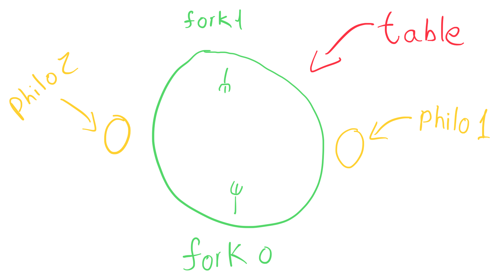

# An approach to solving the dining philosophers problem


## Overview
The **Dining Philosophers Problem** is a computer science problem formulated in 1965 by [Edsger Dijkstra](https://en.wikipedia.org/wiki/Edsger_W._Dijkstra). It involves dealing with concurrent programming, synchronization issues, threads, deadlocks, and race conditions.

#### The Problem

There are one or more philosophers sitting around a table, with a large bowl of spaghetti placed in the middle. In order for a philosopher to eat, they need to use both their left and right forks simultaneously. There are as many forks as there are philosophers. Additionally, the philosophers cannot communicate with each other.

#### The routine

Each philosopher successively eats, sleeps and thinks.

*“When a philosopher has finished eating, they start sleeping. Once awake they think again.”*

#### Arguments to the program (argv)

- `number_of_philos`
- `time_to_die`
- `time_to_eat`
- `time_to_sleep`
- `number_of_times_each_philo_must_eat`

#### Expected output

```other
timestamp_in_ms X has taken a fork
timestamp_in_ms X is eating
timestamp_in_ms X is sleeping
timestamp_in_ms X is thinking
timestamp_in_ms X died
```

in which `X` is the philosopher ID.

***Note***: The message announcing the death of a philosopher should be displayed in no more than ***10 ms*** after the actual death.

## Table

In this project, we will be working with a main data structure in which will contain all the other ones, in the case of the philosophers project, as we will be dealing with threads, more specifically, one thread for each philosopher, we will have to find out how to put this table data structure inside each philosopher for accessing data from each thread.

```c
struct s_table
{
	time_t start_time;
	t_args args;
	t_philo **philos;
	pthread_mutex_t *forks;
};
```

In which, the `start_time` is initialized with the actual start time from the program (in miliseconds), `args` are the command line arguments (a.k.a argv, argument vector), `philos` is a double pointer but it might be easier to think about it as a pointer to an array of philosophers, and the `forks` "array".

By the way, I decided creating a new data structure just to store the command line arguments in which I called `t_args`.

```c
struct s_args
{
	unsigned nb_philos;
	time_t time_to_die;
	time_t time_to_eat;
	time_t time_to_sleep;
	unsigned must_eat;
};
```

And that's how I initialized the values:

```c
void init_args(t_args *args, int argc, char **argv)
{
	args->nb_philos = philo_atoi(argv[1]);
	args->time_to_die = philo_atoi(argv[2]);
	args->time_to_eat = philo_atoi(argv[3]);
	args->time_to_sleep = philo_atoi(argv[4]);
	if (argc == 6)
		args->must_eat = philo_atoi(argv[5]);
	else
		args->must_eat = MUST_EAT_NOT_SET;
}
```

***note***: `MUST_EAT_NOT_SET` is a macro I defined to -1.

And if you're asking yourself why I didn't typedef any of these structures, that's because I "typedefed" all of them above their declaration in the header file.

```c
typedef struct s_table t_table;
typedef struct s_args t_args;
typedef struct s_philo t_philo;
typedef struct timeval t_timeval;
```

## Forks

In my table structure I've got a mutex pointer called forks in which it will point to a block of memory containing all the mutexes used in the program.

```c
pthread_mutex_t *forks;
```

Then, on my data structure that represents a philosopher I have an array with 2 values. The index 0 of this array represents the philosopher's left fork and the index 1 represents the right fork respectively.

```c
unsigned forks[2];
```

***note***: The keyword `unsigned` is an alternative way of writing `unsigned int`.

As I declared my table as a regular variable into `main()`, I won't need to allocate memory for it.

We will just need to allocate memory for the mutexes.

```c
void alloc_forks(t_table *table)
{
  table->forks = malloc(sizeof(pthread_mutex_t) * table->args.nb_philos);
}
```

allocating the desired amount of bytes. (size of a mutex in bytes times the number of philosophers that is the number of forks, in other words, mutexes).

#### Initializing the mutexes

after allocating memory to the created mutexes, we will have to initialize them:

```c
void init_forks(t_table *table)
{
	unsigned i;

	i = 0;
	alloc_forks(table);
	while (i < table->args.nb_philos)
	{
		pthread_mutex_init(&table->forks[i], NULL);
		i++;
	}
}
```

That's it for allocating and initializing mutexes :)

## Dealing with the philosopher data structure

That's the definition for the philosopher data structure:

```c
struct s_philo
{
	pthread_t thread;
	unsigned id;
	unsigned times_ate;
	unsigned forks[2];
	time_t last_meal;
	t_table *table;
};
```

Before doing anything else, we need to of course, allocate memory for the philosophers data structure.

```c
void alloc_philos(t_table *table)
{
	unsigned i;

	table->philos = malloc(sizeof(t_philo *) * table->args.nb_philos);
	i = 0;
	while (i < table->args.nb_philos)
	{
		table->philos[i] = malloc(sizeof(t_philo));
		i++;
	}
}
```

First, we allocate the pointers that will point to each philosopher, then using these pointers that were allocated, we allocate the actual memory for each philosopher.

#### Initializing the philosophers

```c
void init_philos(t_table *table)
{
	unsigned i;

	i = 0;
	alloc_philos(table);
	while (i < table->args.nb_philos)
	{
		table->philos[i]->id = i + 1;
		table->philos[i]->times_ate = 0;
		table->philos[i]->table = table;
		table->philos[i]->forks[0] = i;
		table->philos[i]->forks[1] = (i + 1) % table->args.nb_philos;
		i++;
	}
}
```

Now let's break down this function.

First, we need to assign an ID to each philosopher and it need to begin at 1. As we are indexing using `i` that usually gets initialized at 0, we need to add 1 to it to get the actual id.

So when `i` is 0, that means, the first philosopher will have the ID `i` + 1 that is 1.

The `times_ate` gets an initial value of 0 and we are assigning a pointer to `table` to have a reference inside each thread created later.

#### Assigning forks

The current philosopher's left fork will be `i`. So for example, when $$i = 0$$ the philosopher's ID will be 1 so their left fork will be 0 and their right fork gotta be 1.

To get to the value of 1 we need to index it using the following formula:

$$
(i + 1) \mod n
$$

So imagine we have 2 philosophers (n = 2), the first philosopher's right fork will represent the following index:

$$
(0 + 1) \mod 2
$$

$$
= 1 \mod 2
$$

$$
= 1
$$

The second philosopher will have:

$$
(1 + 1) \mod 2
$$

$$
= 2 \mod 2
$$

$$
= 0
$$

So the first philosopher's left fork will be 0, and the right fork will be 1, while the second philosopher's left fork will be 1 and the right fork will be 0 again. We just succeeded in simulating a round table with forks in between each philosopher.



## Calculating the time stamps

As the program wants the output in miliseconds and the function `gettimeofday()` gives us values in seconds and microseconds, we have to convert both to miliseconds and sum them up.

#### remembering that

$$
1s = 1000ms
$$

#### and that

$$
1μs = \frac{1}{1000}ms
$$

$$
\therefore 1μs = 0.001ms
$$

Now with all the values in miliseconds, we can sum them up to get the current time in miliseconds.

#### Example:

Let’s try converting the following value that is given in seconds to miliseconds.

```c
time_t s_to_ms(time_t s)
{
	return (s * 1000);
}
```

$$
41923s \times 1000 = 41923000ms
$$

Now, let’s convert the microsecond part to miliseconds (discarding the decimal part).

```c
time_t us_to_ms(time_t us)
{
	return (us / 1000);
}
```

$$
\frac{126500}{1000}μs = 126ms
$$

Summing the seconds and microseconds now converted to miliseconds we get:

$$
41923000ms + 126ms = 41923126ms
$$

Now, to get the current time you just subtract the `gettimeofday()` call from the start time that would be the value you saved when calling it for the first time. That would be the code for the conversion made:

```c
void get_current_time(time_t *s, time_t *us)
{
	t_timeval tv;

	gettimeofday(&tv, NULL);
	*s = tv.tv_sec;
	*us = tv.tv_usec;
}

int main(void)
{
	time_t s;
	time_t us;

	get_current_time(&s, &us);

	printf("current_time_in_ms:%ld", s_to_ms(s) + us_to_ms(us));
}
```

## Working with threads

#### Creating threads

So first, we will create the threads that will represent each philosopher.

```c
void create_philos(t_table *table)
{
	unsigned i;

	i = 0;
	while (i < table->args.nb_philos)
	{
		pthread_create(&table->philos[i]->thread, NULL, &routine, table->philos[i]);
		i++;
	}
}
```

Here, we are basically looping through all the philosophers, creating a thread for each philosophers and storing it in `table->philos[i]->thread` Then we are passing to the routine function pointer the current philosopher being created as a parameter (`table->philos[i]`).

Here is the `pthread_create()` function prototype for reference:

```c
int pthread_create(pthread_t *thread, const pthread_attr_t *attr,
                   void *(*start_routine)(void*), void *arg);
```

As you can see above, the routine function requires the parameter and return value's type to be a **void pointer**.

#### Joining threads

After creating our threads, we will need to join them into `main()`again. That way we will be able to see what each thread printed for example without taking the risk of `main()` returning before.

```c
void join_philos(t_table *table)
{
	unsigned i;

	i = 0;
	while (i < table->args.nb_philos)
	{
		pthread_join(table->philos[i]->thread, NULL);
		i++;
	}
}
```

I will call these two functions in a new function I will call `init_simulation()`

```c
void init_simulation(t_table *table)
{
	create_philos(table);
	join_philos(table);
}
```

## The routine

When we create a thread, the thread will start running a routine that is basically a function with a pre-determinate argument and a pre-determinate return value.

Here's a basic example of a routine function:

```c
void *routine(void *arg)
{
	t_philo *philo;

	philo = (t_philo *)arg;

	printf("Hello! I am philo %u!\n", philo->id);
	return (NULL);
}
```

As we passed the "current philosopher" when creating the thread for this philosopher, the parameter `arg` will be replaced with a pointer to the current philosopher.

But as `pthread_create()` doesn't know what variable type we will pass to it, that's why it's declared as a **void pointer** so we need to cast this value to our desired variable type (`t_philo` in this case).
