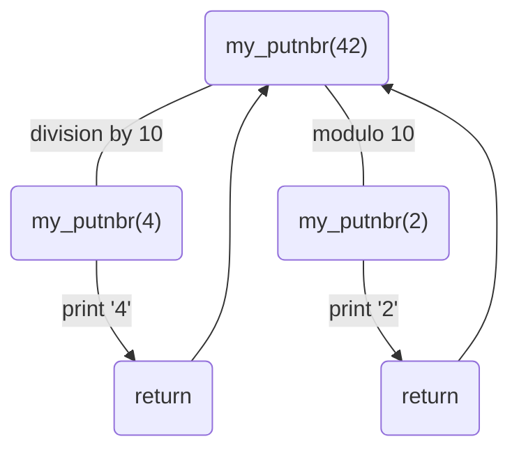

---
tags:
  - 🌱
up: "[[Exam Rank 3]]"
---
# Replicating the Print Function in C

![[DALL·E Feb 19 Design.jpg]]

`printf()` is one of the most useful functions in almost every programming language. In this project, we are going to learn how to implement this function in C using variadic parameters.

## What is a variadic function?

A variadic function, just like `printf()` is a function that can receive an indeterminate number of parameters.

## Prototype

```c
int my_printf(char *fmt, ...);
```

> [!note] Note
> The three dots (`...`) also called **ellipsis** indicates that a function is variadic. A variadic function in C requires at least one parameter, in this case the format string.

## Getting started

The first thing we are going to do is to include the `stdarg` header file:

```c
#include <stdarg.h>
```

Now, inside `my_printf()` function let's declare a variable to store the variadic parameters:

```c
va_list args;
```

Here, `va_list` is a special abstract type that we will use to store all the variadic arguments that got passed to `my_printf()`

To actually initialize this list, we are going to call `va_start()` by passing our argument list with the format string:

```c
va_start(args, fmt);
```

> [!note] Note
> Just like when using something like `malloc()` with `free()`, `va_start()` requires us to use `va_end()` after handling the list.

## Looping through the format string

Now, let's create a loop through the format string and print the current character or the current argument if a `%` is found:

```c
for (i = 0; fmt[i] != '\0'; i++)
{
	if (fmt[i] == '%')
	{
		i++;
		put_fmt(&args, fmt, &size);
	}
	else
	{
		my_putchar(fmt[i]);
		size++;
	}
}
```

> [!note] Note
> Here we are passing the address of `i` because we are going to modify it into `put_fmt()` and we want to keep this modification in the caller function (`my_printf()` in this case)

### Implementing our own `putchar()`

To print a single character to the standard output, we have to use the `write()` function passing the file descriptor we want to write (in this case, standard output), the character we want to print and its size. We are also going to increment the size variable that corresponds to the number of characters `my_printf()` printed:

```c
void my_putchar(int c)
{
	write(STDOUT_FILENO, &c, sizeof(char));
	(*size)++;
}
```

## Printing the format string

In this example, we are only going to support the following formats:

- `%s` for printing a string
- `%d` for printing a decimal number
- `%x` for printing a number in hexadecimal format

### Prototype

```c
void put_fmt(va_list *args, const char c, size_t *size);
```

Here, we are going to check if the current character (in this case, `c`) is equal to one of the format specifiers. We are going to use `va_arg` here to represent the current argument in the argument list passing the type to handle the variadic argument:

```c
switch (c)
{
	case 's':
		my_putstr(va_arg(*args, char *), size);
		break ;

	case 'd':
		my_putnbr(va_arg(*args, int), size);
		break ;
	
	case 'x':
		my_puthex(va_arg(args, unsigned int), size);
}
```

### When the argument parameter is a string:

```c
void my_putstr(char *str, size_t *size)
{
	if (str == NULL)
	{
		my_putstr("(null)", size);
		return ;
	}
	for (int i = 0; str[i] != '\0'; i++)
		my_putchar(str[i], size);
}
```

Here, we just loop through the string parameter and print each character. If `str == NULL` we print the string `(null)` just like the original `printf()` from `stdio.h`

### When the argument parameter is a decimal number:

First, we declare a string containing all the decimal characters:

```c
#define DCM "0123456789"
```

Then, use this recursive function to print a number:

```c
void my_putnbr(int n, size_t *size)
{
	long long ll_n;

	ll_n = (long long)n;

	if (ll_n < 0)
	{
		my_putchar('-', size);
		ll_n = -ll_n;
	}

	if (ll_n < 10)
		my_putchar(DCM[ll_n], size);
	else
	{
		my_putnbr(ll_n / 10, size);
		my_putnbr(ll_n % 10, size);
	}

}
```

This function works as follows:

1. Checks if a number is negative. If so, it prints the minus sign and converts the number to positive.
2. If a number is less than 10, we print the number indexing it from the string.
3. If a number is greater or equal to 10, we call the `my_putnbr()` function recursivelly dividing the number by 10 until we get only one digit.

example:



Imagine we want to print the number `42`:

1. As 42 is positive, we skip the first `if` statement.
2. 42 is also greater than 10 so it gets skipped as well.
3. Now, in the `else` statement, $42 \div 10 = 4$ so we call `my_putnbr()` recursivelly passing the number 4.
4. As 4 is less than 10, 4 gets printed and returns to the caller function.
5. Now that `my_putnbr(ll_n / 10, size)` returned, we call `my_putnbr(ll_n % 10, size)` that calls recursivelly `my_putnbr()` passing $42 \mod 10 = 2$ as a parameter.
6. As 2 is less than 10, 2 gets printed and returns to the caller function.
7. The caller function returns.
8. 42 got printed to the standard output successfully.

### When the argument parameter is a hexadecimal number:

The hexadecimal version is really similar but it does not support negative numbers because `%x` treats every number as `unsigned`:

```c
#define HEX "0123456789abcdef"
```

```c
void my_puthex(unsigned int n, size_t *size)
{
	if (n < 16)
		my_putchar(HEX[n], size);
	else
	{
		my_puthex(n / 16, size);
		my_puthex(n % 16, size);
	}

}
```

## Optional error handling

When using the original `printf()`, you will notice that if you pass a parameter that does not match the format specifier (e.g., passing a string when the format specifier is `%d`), the compiler will issue a warning.

To replicate this behavior in our custom `printf()` function, we can define the prototype for `my_printf()` with this `__attribute__`:

```c
int		my_printf(const char *fmt, ...) __attribute__((format(printf, 1, 2)));
```

This tells the compiler that our function behaves similarly to `printf()`. It specifies that the first parameter contains the format string, and the variadic parameters start from the second parameter.
