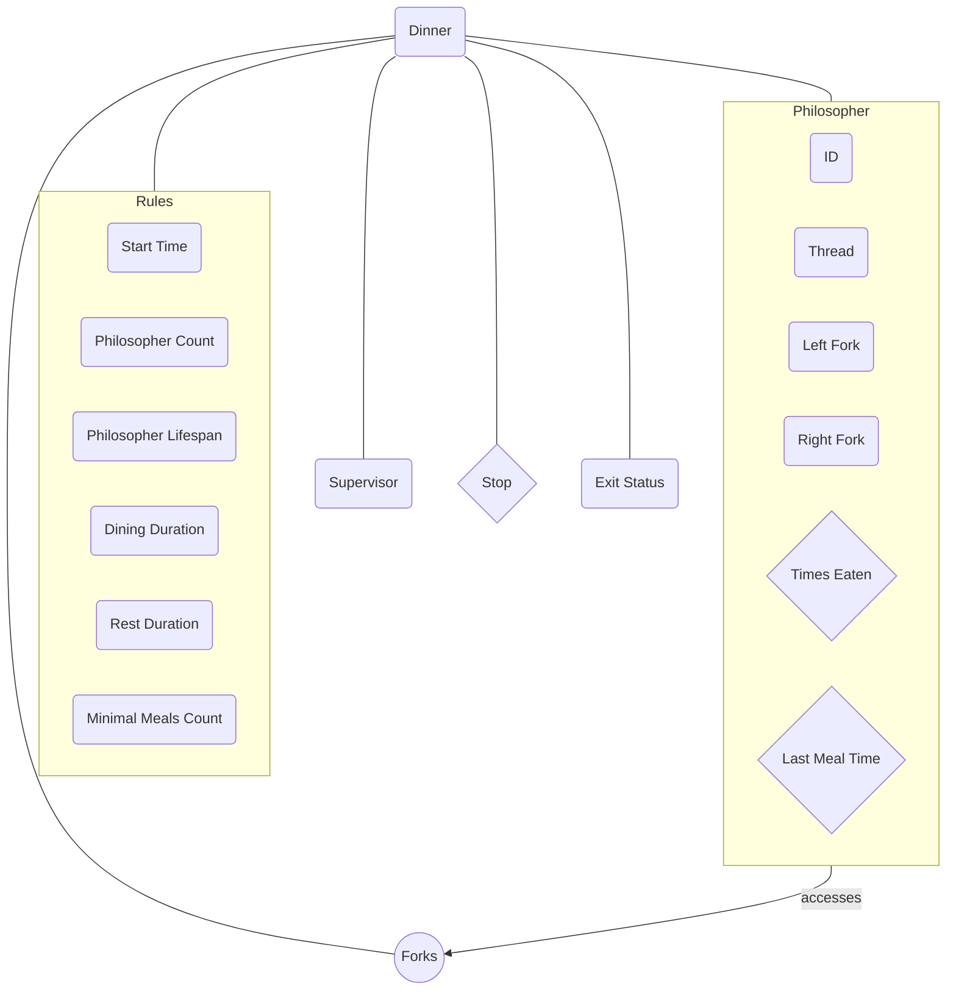

# The Dining Philosophers Problem

![[philo.png]]

## Overview
The **Dining Philosophers Problem** is a computer science problem formulated in 1965 by [Edsger Dijkstra](https://en.wikipedia.org/wiki/Edsger_W._Dijkstra). It involves dealing with concurrent programming, synchronization issues, threads, deadlocks, and race conditions.

#### The Problem

There are one or more philosophers sitting around a table, with a large bowl of spaghetti placed in the middle. In order for a philosopher to eat, they need to use both their left and right forks simultaneously. There are as many forks as there are philosophers. Additionally, the philosophers cannot communicate with each other.

## Organizing data


description:
- A rhombus represents **mutex protected variables**
- A circle represents a **mutex array**
- In code, the left and right forks are represented as `forks[2]` where `forks[0]` represents the left fork and `forks[1]` the right fork

We will define it as:

```c
struct s_dinner
{
	t_rules rules;
	t_philo philos[PHILO_MAX];
	pthread_mutex_t forks[PHILO_MAX];

	pthread_t supervisor;

	bool stop;
	pthread_mutex_t stop_mutex;

	int exit_status;
};
```

Here is the definition of the data structure for storing the dinning party rules:

```c
typedef struct s_rules
{
	t_time start_time;
	unsigned philo_count;
	time_t lifespan;
	time_t dining_duration;
	time_t rest_duration;
	unsigned min_meals;
}   t_rules;
```

### The Philosopher

```c
typedef struct s_philo
{
    int id;
    pthread_t thread;
	t_dinner *dinner;
	int forks[2];

	int times_eaten;
	pthread_mutex_t times_eaten_mutex;
	
	time_t last_meal_time;
	pthread_mutex_t last_meal_time_mutex;
}   t_philo;
```

## Starting the dinner party

Before actually start creating threads and running the philosopher routines we have to prepare the dinner party. By preparing the dinner party I mean doing some input error checking and variable initialization.

### can_prepare_dinner()

```c
bool	can_prepare_dinner(t_dinner *dinner, int argc, char **argv)
{
	initialize_exit_status(dinner);
	if (correct_input(dinner, argc, argv))
	{
		set_dinner_rules(dinner, argc, argv);
		if (can_initialize_forks(dinner))
		{
			initialize_philosophers(dinner);
			if (can_initialize_stop_mutex(dinner))
				if (can_initialize_print_mutex(dinner))
					return (true);
		}
	}
	return (false);
}
```

Here, we are first initializing the `exit_status` variable to a macro called `SUCCESS` that I defined to `0`:

```c
void	initialize_exit_status(t_dinner *dinner)
{
	dinner->exit_status = SUCCESS;
}
```

After that, I check the user's input and throw an error in the following cases:

- If the number of args is less than 4 and more than 5
- If there are non-alphabetic characters
- If `atoi()` fails converting an argument
- If a negative argument is provided

```c
bool	correct_input(t_dinner *dinner, int argc, char **argv)
{
	int	i;
	int	curr_arg;

	if (incorrect_num_of_args(argc, dinner))
		return (false);
	i = 1;
	while (i < argc)
	{
		if (not_only_digits(argv[i], dinner))
			return (false);
		if (!can_convert_str_to_int(dinner, argv[i], &curr_arg))
			return (false);
		if (wrong_num(i, curr_arg, dinner))
			return (false);
		i++;
	}
	return (true);
}
```

After checking the input, we can insert this data into the `dinner` data structure:

```c
void	set_dinner_rules(t_dinner *dinner, int argc, char **argv)
{
	set_dinner_start_time(dinner);
	dinner->rules.philo_count = my_atoi(argv[1]);
	dinner->rules.lifespan = my_atoi(argv[2]);
	dinner->rules.dining_duration = my_atoi(argv[3]);
	dinner->rules.rest_duration = my_atoi(argv[4]);
	if (argc == 6)
		dinner->rules.min_meals = my_atoi(argv[5]);
	else
		dinner->rules.min_meals = MIN_MEALS_NOT_SET;
}
```

In this problem, the 5th argument is optional, so in case it is not set, we set it as `MIN_MEALS_NOT_SET`.

As there are as many forks as philosophers we can loop through the forks array `philo_count` times and initialize the mutexes:

```c
bool	can_initialize_forks(t_dinner *dinner)
{
	int	i;

	i = 0;
	while (i < dinner->rules.philo_count)
	{
		if (pthread_mutex_init(&dinner->forks[i], NULL) != SUCCESS)
		{
			handle_mutex_init_failure(dinner, i);
			report_and_set_error(dinner, ERR_MUTEX_INIT, MSG_MUTEX_INIT);
			return (false);
		}
		i++;
	}
	return (true);
}
```

> [!note] Note
> When creating mutexes, we have to handle possible errors just like when
> using malloc. In case of an error, `pthread_mutex_create()` returns a value
> different from `0` and we have to call a function called
> `pthread_mutex_destroy()` to destroy all the created mutexes

```c
static void	handle_mutex_init_failure(t_dinner *dinner, int i)
{
	while (i > 0)
	{
		i--;
		pthread_mutex_destroy(&dinner->forks[i]);
	}
}
```

Now, let's initialize the philosophers array:

Where:
- The philosopher's `id` starts at 1
- `times_eaten` is initialized to 0
- `dinner` is a pointer back to the `dinner` main data structure
- `last_meal_time` is initialized to the current time
- extra mutexes for variables shared between threads like `last_meal_time` and `times_eaten` are created

```c
void	initialize_philosophers(t_dinner *dinner)
{
	int	i;

	i = 0;
	while (i < dinner->rules.philo_count)
	{
		dinner->philos[i].id = i + 1;
		dinner->philos[i].times_eaten = 0;
		dinner->philos[i].dinner = dinner;
		assign_forks(&dinner->philos[i]);
		dinner->philos[i].last_meal_time = get_time_in_ms();
		pthread_mutex_init(&dinner->philos[i].times_eaten_mutex, NULL);
		pthread_mutex_init(&dinner->philos[i].last_meal_time_mutex, NULL);
		i++;
	}
}
```

### Determining if a philosopher is left or right handed

```c
void	assign_forks(t_philo *philo)
{
	if (philosopher_is_left_handed(philo))
		assign_left_fork_first(philo);
	else
		assign_right_fork_first(philo);
}
```

When assigning forks, we first need to determine whether the philosopher takes the left fork first and then the right fork, or vice versa. To determine whether the philosopher is left or right-handed, we check their index to see if it is even or odd. If it is even, then the philosopher will be considered left-handed. This is entirely arbitrary, and I could have designated an even ID for a right-handed philosopher.

```c
static bool	philosopher_is_left_handed(t_philo *philo)
{
	return (philo->id % 2);
}
```

### Assigning forks

```c
static void	assign_left_fork_first(t_philo *philo)
{
	philo->forks[0] = philo->id;
	philo->forks[1] = (philo->id + 1) % philo->dinner->rules.philo_count;
}

static void	assign_right_fork_first(t_philo *philo)
{
	philo->forks[1] = philo->id;
	philo->forks[0] = (philo->id + 1) % philo->dinner->rules.philo_count;
}
```

So the first philosopher's left fork will be the `i` in the forks array and their right fork will be the `i + 1` fork.

The modulo operation here is used to make the last philosopher's right fork be the first fork in the array. This way we can make the table circular by making the last fork be the first fork:

let the number of philosophers be $n$ and the current philosopher id be $i + 1$:

$$
(i + 1) \mod n
$$

Imagine we have 3 philosophers:

First iteraction:

The philosopher's left fork will be $i$, or 0 and their right fork will be 1:

$$
\begin{align*}
(0 + 1) \mod 3 \\
1 \mod 3 \\
1
\end{align*}
$$

Resulting into:

```
ID: 1 L: 0 R: 1
```

Second iteraction:

Now $i = 1$ so the second philosopher's left fork will be 1 and their right fork will be 2:

$$
\begin{align*}
(1 + 1) \mod 3 \\
2 \mod 3 \\
2
\end{align*}
$$

Output:

```
ID: 2 L: 1 R: 2
```

Third iteraction:

Now $i = 2$ and since we are running this loop until $i < n$ this is the last iteraction:

So the third philosopher's left fork will be 2 and their right fork will be 0:

$$
\begin{align*}
(2 + 1) \mod 3 \\
3 \mod 3 \\
0
\end{align*}
$$

Output:

```
ID: 3 L: 2 R: 0
```

## Displaying the timestamps

In this project, we are required to use the [[gettimeofday()]] function for displaying time in microseconds ($\mu s$)

By accessing `tv_sec` and `tv_usec`, both members of `struct timeval`, we can calculate the current time in microseconds ($\mu s$) using the following formula:

$$
\begin{align*}
T_{ms} \; = \; (T_{s} \; \times \; 10^3) \; + \; \frac{T_{\mu s}}{10^3}
\end{align*}
$$

See: [[Seconds Unit Conversion]]

### Implementation

We can create 3 separate functions for each conversion seen above to get the current time in miliseconds ($ms$):

```c
time_t s_to_ms(time_t s)
{
	return (s * 1000);
}

time_t us_to_ms(time_t us)
{
	return (us / 1000);
}

time_t get_time_in_ms(void)
{
	struct timeval tv;
	
	gettimeofday(&tv, NULL);
	return (s_to_ms(tv.tv_sec) +
			us_to_ms(tv.tv_usec));
}
```

## Displaying and returning errors

In case of any error in this program, the error message will be displayed with a print statement protected by a mutex and return an error code.

```c
void	report_and_set_error(t_dinner *dinner, int code, char *msg)
{
	pthread_mutex_lock(&dinner->print_mutex);
	printf("philo: %s\n", msg);
	dinner->exit_status = code;
	pthread_mutex_unlock(&dinner->print_mutex);
}
```

Here are the error messages of possible errors in the program:

```c
# define MSG_NUM_ARGS "Incorrect number of arguments."
# define MSG_NOT_ONLY_DIGITS "Not only digits."
# define MSG_ATOI "Atoi error."
# define MSG_NUM_PHILOS "Wrong number of philosophers."
# define MSG_NUM "Argument must be positive"
# define MSG_MUTEX_INIT "Error initializing mutex."
# define MSG_THREAD_CREATE "Error creating thread."
# define MSG_THREAD_JOIN "Error joining thread."
```

with their error codes declared into an enum:

```c
enum						e_exit_status
{
	SUCCESS,
	ERR_NUM_ARGS,
	ERR_NOT_ONLY_DIGITS,
	ERR_ATOI,
	ERR_NUM_PHILOS,
	ERR_NUM,
	ERR_MUTEX_INIT,
	ERR_THREAD_CREATE,
	ERR_THREAD_JOIN
};
```

## Printing the philosopher status

There are 5 kinds of messages a philosopher can print:

1. When a philosopher dies
2. When a philosopher is eating
3. When a philosopher is sleeping
4. When a philosopher is thinking
4. When a philosopher takes a fork

So let's define these messages that will be printed as string macros:

```c
# define MSG_DEAD "died"
# define MSG_EATING "is eating"
# define MSG_SLEEPING "is sleeping"
# define MSG_THINKING "is thinking"
# define MSG_TAKING_FORK "has taken a fork"
```

Then a number to represent each status:

```c
enum						e_philo_status
{
	DEAD,
	EATING,
	SLEEPING,
	THINKING,
	TAKING_FORK
};
```

Now, using the `print_philo_status()` function, we can select which status we want to print, then print the current status as required by the subject. Of course, we have to protect the print statement by mutexes:

```c
void	print_philo_status(t_philo *philo, t_philo_status status)
{
	if (check_stop_condition_safely(&philo->dinner->stop_mutex,
			&philo->dinner->stop))
		return ;
	if (status == DEAD)
		print_in_required_format(philo, MSG_DEAD);
	else if (status == EATING)
		print_in_required_format(philo, MSG_EATING);
	else if (status == SLEEPING)
		print_in_required_format(philo, MSG_SLEEPING);
	else if (status == THINKING)
		print_in_required_format(philo, MSG_THINKING);
	else if (status == TAKING_FORK)
		print_in_required_format(philo, MSG_TAKING_FORK);
}
```

Printing in the required format:

```c
static void	print_in_required_format(t_philo *philo, char *action)
{
	pthread_mutex_lock(&philo->dinner->print_mutex);
	printf("%ld %d %s\n", get_time_in_ms() - philo->dinner->rules.start_time,
		philo->id, action);
	pthread_mutex_unlock(&philo->dinner->print_mutex);
}
```

## Working with threads

Now that we finished preparing the `dinner`, we can start the dinner by getting the current time (the dinner start time) and create threads for each philosopher. To create a thread we need to use the [[pthread_create()]] function.

```c
void	start_dinner(t_dinner *dinner)
{
	int	i;

	i = 0;
	dinner->rules.start_time = get_time_in_ms();
	while (i < dinner->rules.philo_count)
	{
		if (!can_create_thread(&dinner->philos[i].thread, philo_routine,
				&dinner->philos[i]))
		{
			report_and_set_error(dinner, ERR_THREAD_CREATE, MSG_THREAD_CREATE);
			return ;
		}
		i++;
	}
}
```

Here, for readability purposes, I separeted the `pthread_create()` proccess into a separate function.

```c
bool	can_create_thread(pthread_t *thread, void *(*routine)(void *),
		void *arg)
{
	if (pthread_create(thread, NULL, routine, arg) != SUCCESS)
		return (false);
	return (true);
}
```

Here, for each philosopher thread that gets created, the `philo_routine` function will get called through a function pointer.

```c
void	*philo_routine(void *arg)
{
	t_philo	*philo;

	philo = (t_philo *)arg;
	align_start_times(philo->dinner->rules.start_time);
	if (philo->dinner->rules.philo_count == 1)
		return (lonely_philosopher(philo));
	while (!check_stop_condition_safely(&philo->dinner->stop_mutex,
			&philo->dinner->stop))
	{
		eat(philo);
		rest(philo);
		think(philo);
	}
	return (NULL);
}
```

As the `routine` function is defined to always receive and return void pointers, we have to cast the argument to a pointer to `philo`.

Then, using the `align_times()` function, we can make all threads start at the same time. This function basically keeps getting the current time and waits until the current thread reaches the `start_time`:

```c
void	align_start_times(time_t start_time)
{
	while (get_time_in_ms() < start_time)
		continue ;
}
```

After that, we have to check for a special case, when there is only one philosopher. As each philosopher needs 2 forks to eat and the number of forks is equal to the number of philosopher, the only thing the philosopher can do when he is alone is to get a fork and wait until he dies.

Here the philosopher:
- Takes a fork with a print statement
- Waits until his death
- Announces the death
- Unlock the fork

```c
void	*lonely_philosopher(t_philo *philo)
{
	pthread_mutex_lock(&philo->dinner->forks[philo->forks[0]]);
	print_philo_status(philo, TAKING_FORK);
	life_check_and_wait(philo, philo->dinner->rules.lifespan);
	print_philo_status(philo, DEAD);
	pthread_mutex_unlock(&philo->dinner->forks[philo->forks[0]]);
	return (NULL);
}
```

Now, if there are more than 1 philosopher, we repeat the routine of `eat()`, `rest()` and `think()` until someone dies or the number that each philosopher must eat is reached. In other words, when `stop` becomes true.

```c
	while (!check_stop_condition_safely(&philo->dinner->stop_mutex,
			&philo->dinner->stop))
	{
		eat(philo);
		rest(philo);
		think(philo);
	}
```

## The routine

### eat()

To implement `eat()` we first:
- Take 2 forks and announce it
- Announce that a philosopher is eating
- Wait until `dining_duration` is met
- Increment the `times_eaten` variable
- Update the time of the `last_meal_time` variable
- Release the forks

```c
void	eat(t_philo *philo)
{
	take_forks(philo);
	print_philo_status(philo, EATING);
	life_check_and_wait(philo, philo->dinner->rules.dining_duration);
	update_times_eaten_safely(&philo->times_eaten_mutex, &philo->times_eaten,
		philo->times_eaten + 1);
	update_last_meal_time_safely(&philo->last_meal_time_mutex,
		&philo->last_meal_time, get_time_in_ms());
	release_forks(philo);
}
```

Here, the `take_forks()` and `release_forks()` implementation are almost the same. We lock/mutex the mutex for a specific fork and announce it:

```c
void	take_left_fork(t_philo *philo)
{
	pthread_mutex_lock(&philo->dinner->forks[philo->forks[0]]);
	print_philo_status(philo, TAKING_FORK);
}

void	take_right_fork(t_philo *philo)
{
	pthread_mutex_lock(&philo->dinner->forks[philo->forks[1]]);
	print_philo_status(philo, TAKING_FORK);
}

void	take_forks(t_philo *philo)
{
	take_left_fork(philo);
	take_right_fork(philo);
}
```

```c
void	release_left_fork(t_philo *philo)
{
	pthread_mutex_unlock(&philo->dinner->forks[philo->forks[0]]);
}

void	release_right_fork(t_philo *philo)
{
	pthread_mutex_unlock(&philo->dinner->forks[philo->forks[1]]);
}

void	release_forks(t_philo *philo)
{
	release_left_fork(philo);
	release_right_fork(philo);
}
```

The functions `update_times_eaten_safely()` and `update_last_meal_time_safely()` are almost the same and only their types are different. That is something that would not be necessary if we used generics.

```c
void	update_times_eaten_safely(pthread_mutex_t *mutex,
		unsigned int *times_eaten, unsigned int new_value)
{
	pthread_mutex_lock(mutex);
	*times_eaten = new_value;
	pthread_mutex_unlock(mutex);
}

void	update_last_meal_time_safely(pthread_mutex_t *mutex,
		time_t *last_meal_time, time_t new_value)
{
	pthread_mutex_lock(mutex);
	*last_meal_time = new_value;
	pthread_mutex_unlock(mutex);
}
```

These functions basically updates a variable that is shared between threads by protecting them using a mutex before the operation. I created a similar function but that checks a value instead of updating it:

```c
unsigned int	check_times_eaten_safely(pthread_mutex_t *mutex,
		unsigned int *times_eaten)
{
	unsigned int	after_check;

	pthread_mutex_lock(mutex);
	after_check = *times_eaten;
	pthread_mutex_unlock(mutex);
	return (after_check);
}

time_t	check_last_meal_time_safely(pthread_mutex_t *mutex,
		time_t *last_meal_time)
{
	time_t	after_check;

	pthread_mutex_lock(mutex);
	after_check = *last_meal_time;
	pthread_mutex_unlock(mutex);
	return (after_check);
}
```

### rest()

`rest()` is simpler. It just prints and announces that a philosopher is sleeping:

```c
void	rest(t_philo *philo)
{
	print_philo_status(philo, SLEEPING);
	life_check_and_wait(philo, philo->dinner->rules.rest_duration);
}
```

### think()

`think()` is also similar:

```c
void	think(t_philo *philo)
{
	print_philo_status(philo, THINKING);
	life_check_and_wait(philo, calculate_thinking_duration(philo));
}
```

In the case of `think()` as it is not a value provided as a command line argument, we can calculate a value for which a philosopher will stay thinking:

```c
thinking_duration = (lifespan - fasting_duration - dining_duration) / 2
```

In case this results into a negative value or a value that is too big, we set the `thinking_duration` to these values as default:

```c
if (thinking_duration <= 0)
	thinking_duration = 1;
if (thinking_duration > 600)
	thinking_duration = 200;
```

## The supervisor

Back to the `start_dinner()` function, after creating threads for each philosopher, we are going to create one extra thread for the supervisor. The supervisor's roles is to update the `end` variable that gets changed if a philosopher dies or if all the philosophers ate at least `min_meals` times.

> [!info] info
> The supervisor only gets created if there are more than 1 philosophers.

### The supervisor routine

```c
void	*supervisor_routine(void *arg)
{
	int			i;
	t_dinner	*dinner;

	dinner = (t_dinner *)arg;
	align_start_times(dinner->rules.start_time);
	while (true)
	{
		i = 0;
		while (i < dinner->rules.philo_count)
		{
			pthread_mutex_lock(&dinner->philos[i].last_meal_time_mutex);
			if (died_from_starvation(dinner, i))
				return (NULL);
			if (philosopher_is_full(dinner, i))
				return (NULL);
			pthread_mutex_unlock(&dinner->philos[i].last_meal_time_mutex);
			i++;
		}
	}
	return (NULL);
}
```

As with the `philo_routine()`, here we wait for all the other threads to start at the same time using the `align_times()` function. Then, we loop infinitely through all the philosophers and see if someone `died_from_starvation()` or if a `philosopher_if_full()`

#### died_from_starvation()

This function checks if the span a philosopher spent without eating (the difference between the current time and the last meal time) is bigger than his lifespan:

```c
bool	died_from_starvation(t_dinner *dinner, int i)
{
	if (get_time_in_ms()
		- dinner->philos[i].last_meal_time >= dinner->rules.lifespan)
	{
		print_philo_status(&dinner->philos[i], DEAD);
		update_stop_condition_safely(&dinner->stop_mutex, &dinner->stop, true);
		pthread_mutex_unlock(&dinner->philos[i].last_meal_time_mutex);
		return (true);
	}
	return (false);
}
```

#### philosopher_is_full()

This function just compares the times a philosopher ate with the minimal number of times a philosopher must it if it is set:

```c
bool	philosopher_is_full(t_dinner *dinner, int i)
{
	if (dinner->rules.min_meals != (unsigned int)MIN_MEALS_NOT_SET)
	{
		if (check_times_eaten_safely(&dinner->philos[i].times_eaten_mutex,
				&dinner->philos[i].times_eaten) > dinner->rules.min_meals)
		{
			update_stop_condition_safely(&dinner->stop_mutex, &dinner->stop,
				true);
			pthread_mutex_unlock(&dinner->philos[i].last_meal_time_mutex);
			return (true);
		}
	}
	return (false);
}
```

## end_dinner()

`end_dinner()` is really similar to `start_dinner()` but the difference is that here we are not creating threads but joining them back to the main thread. In other words, even if a thread finished after or before the main thread, they will all wait until the other threads stops executing:

```c
void	end_dinner(t_dinner *dinner)
{
	int	i;

	i = 0;
	while (i < dinner->rules.philo_count)
	{
		if (!can_join_thread(dinner->philos[i].thread))
		{
			report_and_set_error(dinner, ERR_THREAD_JOIN, MSG_THREAD_JOIN);
			return ;
		}
		i++;
	}
	if (dinner->rules.philo_count > 1)
	{
		if (!can_join_thread(dinner->supervisor))
		{
			report_and_set_error(dinner, ERR_THREAD_JOIN, MSG_THREAD_JOIN);
			return ;
		}
	}
}
```

I separated the joining proccess into another function just like when using `pthread_create()` for readability purposes:

```c
bool	can_join_thread(pthread_t thread)
{
	if (pthread_join(thread, NULL) != SUCCESS)
		return (false);
	return (true);
}
```
