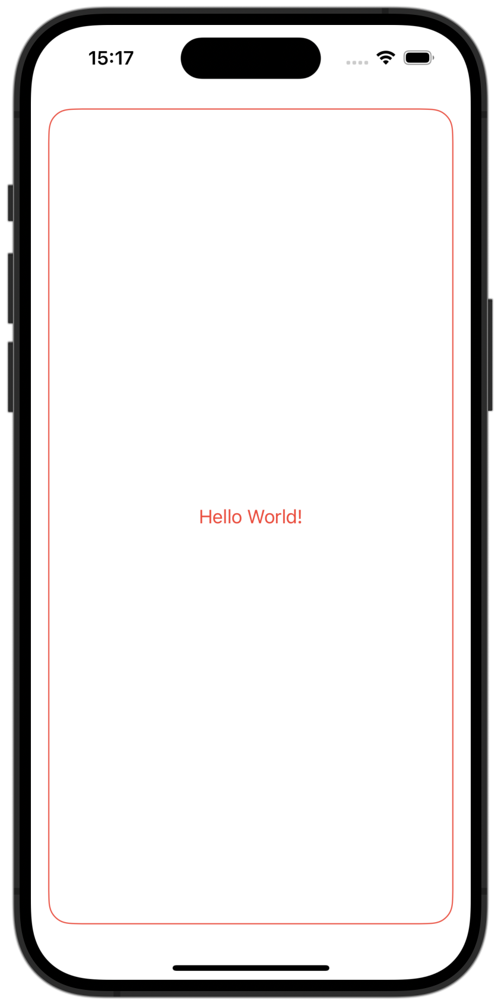
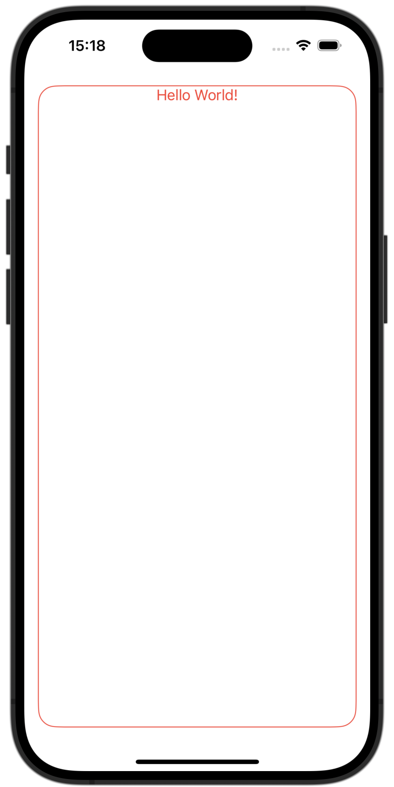
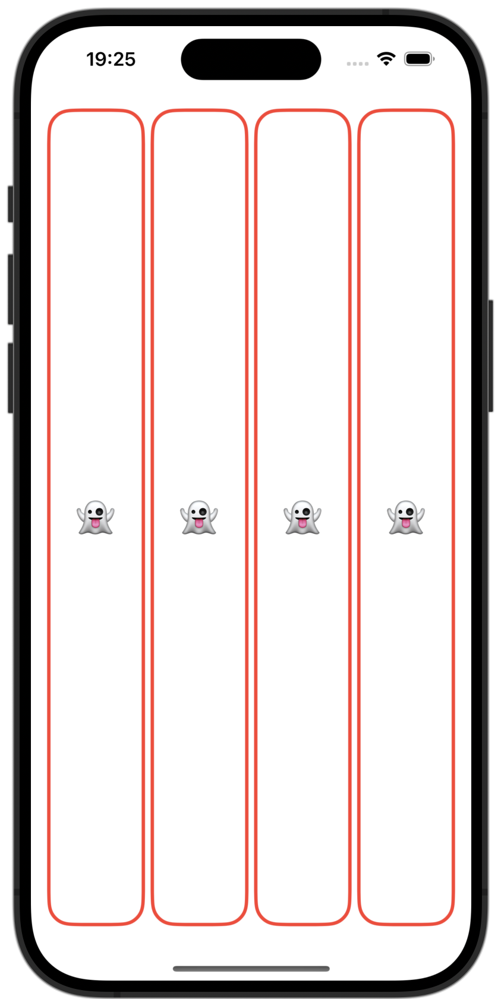
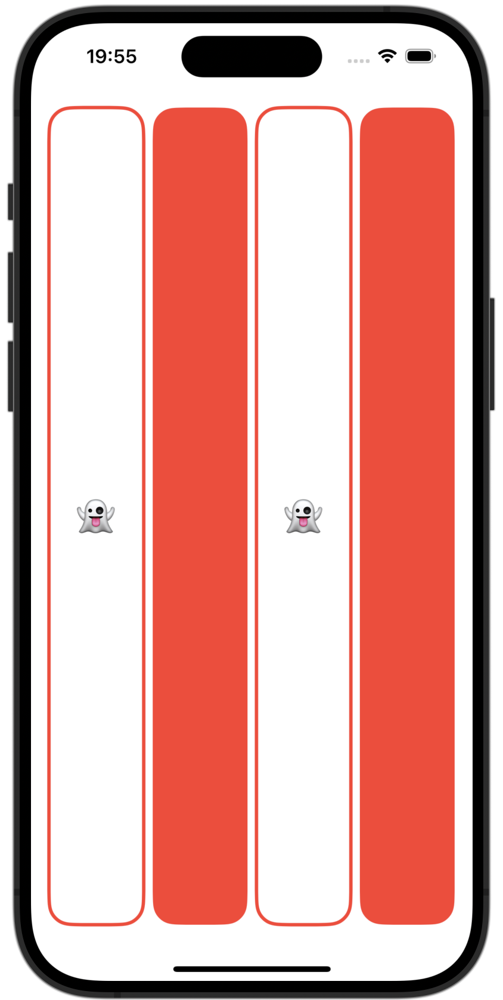
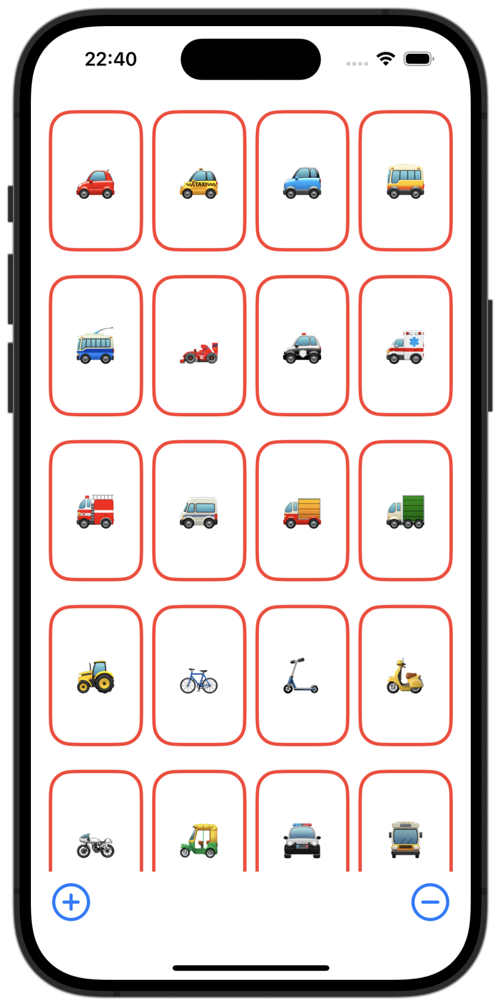

# Getting started with SwiftUI (Stanford CS193p)

![[swiftui-intro-cover.png]]

This struct behaves like a view (the struct conforms to the `View` protocol)
The `View` protocol requires you to have the body variable (of type 'some View')

```swift
struct ContentView: View {
	var body: some View {
	
	}
}
```

The block (curly brackets) after the variable declaration represents a function (closure) and the value it returns gets assigned to the variable `body`. As long as it is a view (`VStack`, `Text`, `Image`, etc) it is ok to assign it. (note: writing the keyword `return` here is optional!)

```swift
struct ContentView: View {
	var body: some View {
		return Text("Hello World!")
	}
}
```

### Shapes
#### RoundedRectangle()

We can return the `RoundedRectangle()` view specifying its `cornerRadius` and calling modifier functions like `.padding()` (can receive an optional argument like `.horizontal`) and `.stroke()` (contrary to `.fill()`) to outline a shape (can receive an optional argument like `lineWidth: 3`).


```swift
struct ContentView: View {
	var body: some View {
		RoundedRectangle(cornerRadius: 20)
			.stroke()
			.padding()
	}
}
```

```swift
struct ContentView: View {
	var body: some View {
		RoundedRectangle(cornerRadius: 20)
			.stroke(lineWidth: 3)
			.padding(.horizontal)
			.foregroundColor(.red)
	}
}
```

Tip: You can write just `.red` instead of `Color.red` when defining the foreground color.

### View Combiners
#### The ZStack()

The `ZStack()` receives a closure as a parameter. (this closure is called a **View Builder**)

```swift
struct ContentView: View {
	var body: some View {
		ZStack(content: {})
	}
}
```

The **View Builder** allows us to list all the views we want to combine and turns it into another view. You also don't need to write `return` inside the **View Builder**.

```swift
    var body: some View {
        ZStack(content: {
            RoundedRectangle(cornerRadius: 20)
                .stroke()
                .padding()
            Text("Hello World!")
        })
    }
```

#### Modifying the View Combiner

Applying a modifier function to a view combiner will apply the properties to all the view within it.

```swift
    var body: some View {
        ZStack(content: {
            RoundedRectangle(cornerRadius: 20)
                .stroke()
            Text("Hello World!")
        })
        .padding()
        .foregroundColor(.red)
    }
```

Preview:



#### Setting the alignment

```swift
    var body: some View {
        ZStack(alignment: .top, content: {
            RoundedRectangle(cornerRadius: 20)
                .stroke()
            Text("Hello World!")
        })
        .padding()
        .foregroundColor(.red)
    }
```

Preview:



#### Simplifying the code

When the last argument of a function is also a function you can simplify the code like this:

This code:

```swift
    var body: some View {
        ZStack(content: {
        })
    }
```

becomes:

```swift
    var body: some View {
        ZStack() {
        }
    }
```

You can also remove the parenthesis from the ZStack

```swift
    var body: some View {
        ZStack {
        }
    }
```

#### Encapsulating views

To avoid redundancy, we can get our `ZStack` representing a card and turn it into a view itself.

```swift
struct CardView: View {
    var body: some View {
        ZStack {
            RoundedRectangle(cornerRadius: 20)
                .stroke()
            Text("👻")
        }
    }
}
```

And then call it form the `ContentView` in a `HStack` (horizontal stack):

```swift
struct ContentView: View {
    var body: some View {
        HStack {
            CardView()
            CardView()
            CardView()
            CardView()
        }
        .padding()
        .foregroundColor(.red)
    }
}
```



#### Creating local variables

Instead of repetitively calling `RoundedRectangle()`, we can assign it to a variable (`rectangle` in this case) and use it instead to make our code look cleaner.

```swift
let rectangle = RoundedRectangle(cornerRadius: 20)
rectangle
	.fill()
	.foregroundColor(.white)
rectangle
	.stroke(lineWidth: 3)
Text("👻")
	.font(.largeTitle)
```

#### Flipping the card using boolean values

Here, we created a boolean variable called `isFaceUp` and initialized it to `true`. Then, using the `if` control flow structure, we can change what kind of view we would like to display (if it is the card with a white background and text or just a card filled in red.)

```swift
var isFaceUp = true
```

```swift
if isFaceUp {
	rectangle
		.fill()
		.foregroundColor(.white)
	rectangle
		.stroke(lineWidth: 3)
	Text("👻")
		.font(.largeTitle)
} else {
	rectangle
		.fill()
}
```

Passing `isFaceUp` as a parameter when calling `CardView`:

```swift
HStack {
	CardView(isFaceUp: true)
	CardView(isFaceUp: false)
	CardView(isFaceUp: true)
	CardView(isFaceUp: false)
}
```



#### View Mutability and `@State`

If we try to add `.onTapGesture()` to our `ZStack` to change the value of a variable, we will get an error because all views are immutable. In this case, we want to change the value of `isFaceUp`, but as it is not possible we can add `@State` to it to turn it into a pointer to a boolean to somewhere in memory and whenever it changes the `body` view gets rebuilt.

```swift
@State var isFaceUp = true

var body: some View {
	ZStack {

	}
	.onTapGesture {
        isFaceUp = !isFaceUp
    }
}
```

#### Using dynamic text

We can create a new variable inside our `CardView` called content (representing the content for the `Text`) and pass the content dynamically from the `ContentView`:

```swift
struct CardView: View {
	var content: String

	var body: some View {
		ZStack {
			...
			Text(content)
			...
		}
	}
}
```

Then from the `ContentView`, let's create an array of strings for the card contents and indexing from this array when passing the content to the `CardView`

```swift
struct ContentView: View {
	var emojis: [String] = ["👻", "⛩️", "🔗", "🌹"]

	var body: some View {
		HStack {
			CardView(content: emojis[0])
			CardView(content: emojis[1])
			CardView(content: emojis[2])
			CardView(content: emojis[3])
		}
	}
}
```

But, to write it in a less methodical way we can use a `ForEach` statement with `emoji` being a variable representing the current item from an iteration.

```swift
ForEach(emojis) { emoji in
	CardView(content: emoji)
}
```

But the code above will not work because to use a `ForEach` we need to make each item from our array conform to the `Identifiable` protocol meaning that each item must be unique and have an ID.

To solve this problem, we can add `id` as a parameter to `ForEach` and set it to `\.self` meaning that the variable itself is going to be it's own ID.

```swift
ForEach(emojis, id: \.self) { emoji in
	CardView(content: emoji)
}
```

#### Working with ranges

Imagine we have a really long array and only want to display emojis from a certain range. We can achieve this by using the indexing syntax.

Example:

```swift
var emojis: [String] = ["🚗", "🚕", "🚙", "🚌", "🚎", "🏎️", "🚓", "🚑", "🚒", "🚐", "🚚", "🚛", "🚜", "🚲", "🛴", "🛵", "🏍️", "🛺", "🚔", "🚍", "🚘", "🚖", "🚡", "🚠", "🚟", "🚃", "🚞", "🚝", "🚄", "🚅"]

0..<5 //Will exclude the 5
0...5 //Will include the 5
```

Now, let's index `emojis` inside out `ForEach` to only the first 4 items:

```swift
ForEach(emojis[0..<4], id: \.self) { emoji in
    CardView(content: emoji)
}
```

#### Buttons

Now we are going to add a button to add and remove cards. This is how we use a `Button` in Swift:

```swift
Button(action: {}, label: {})
```

We can now create a variable to keep track of how many items we want to display and set it as the range when iterating through  the `emojis` array:

```swift
@State var emojiCount = 4

...

ForEach(emojis[0..<emojiCount], id: \.self) { emoji in
    CardView(content: emoji)
}
```

Now, we can create 2 buttons and increment/decrement this variable (Inserting it into a horizontal stack and adding a `Spacer()` in between the 2 buttons.)

```swift
HStack {
	Button(action: {
		emojiCount += 1
	}, label: {
		Text("+")
	})
	Spacer()
	Button(action: {
		emojiCount -= 1
	}, label: {
		Text("-")
	})
}
.padding()
```

Now, to clean up the code we can turn the block of code for creating the `Button` into a new variable of type `some View` and use it instead.

```swift
var add: some View {
	Button(action: {
		emojiCount += 1
	}, label: {
		Text("+")
	})
}
var remove: some View {
	Button(action: {
		emojiCount -= 1
	}, label: {
		Text("-")
	})
}
```

And use it like this:

```swift
HStack {
	add
	Spacer()
	remove
}
```

##### Using SFSymbols for the buttons

Syntax:

```swift
Image(systemName: "SYMBOLNAME")
```

Use case:

```swift
Button(action: {
	emojiCount -= 1
}, label: {
	Image(systemName: "minus.circle")
})
```

##### Syntactic sugar for simplifying the Button syntax

```swift
Button(action: {}, label: {})
```

Becomes:

```swift
Button {} label: {}
```

##### Adding limits for our ranges

When incrementing/decrementing `emojiCount`, we have to be careful to not let it get to an invalid index inside our array (a value less than zero or upper to the array's number of elements.)

```swift
var add: some View {
	Button {
		if (emojiCount < emojis.count) {
			emojiCount += 1
		}
	} label: {
		...
	}
}

var remove: some View {
	Button {
		if (emojiCount > 1) {
			emojiCount -= 1
		}
	} label: {
		...
	}
}
```

#### Grids

We can use a `LazyVGrid` Instead of the `HStack` to order our cards into a grid. (When using a `LazyVGrid` we only have to specify the number of columns and all the rows are going to be created as necessary contrary to a `LazyHGrid`)

```swift
LazyVGrid(columns: [GridItem(), GridItem(), GridItem()]) {
	ForEach(emojis[0..<emojiCount], id: \.self) { emoji in
		CardView(content: emoji)
	}
}
```

where columns is an array of `GridItem()`

#### Setting the aspect ratio for a card

We can call `.aspectRatio()` on our `CardView` to set the aspect ratio like this:

```swift
CardView(content: emoji).aspectRatio(2/3, contentMode: .fit)
```

Sets the aspect ratio to 2 wide / 3 high.

#### Using a scroll view

We can wrap our `LazyVGrid` into a `ScrollView` to be able to scroll:

```swift
ScrollView {
	LazyVGrid(columns: [GridItem(), GridItem(), GridItem()]) {
		ForEach(emojis[0..<emojiCount], id: \.self) { emoji in
			CardView(content: emoji).aspectRatio(2/3, contentMode: .fit)
		}
	}
}
```

#### Working with an adaptive grid item

We can set our array of grid items to just one `GridItem()` and make it adaptive setting the minimum width for the row.

```swift
GridItem(.adaptive(minimum: 80))
```

```swift
ScrollView {
	LazyVGrid(columns: [GridItem(.adaptive(minimum: 80))]) {
		ForEach(emojis[0..<emojiCount], id: \.self) { emoji in
			CardView(content: emoji).aspectRatio(2/3, contentMode: .fit)
		}
	}
}
```


