# Implementing Zettelkasten

## Capturing Flow

```mermaid
flowchart LR

A("️🌱 Seedlings")
C("️🌿 Ferns")
D("🌲 Evergreen")
E("🗺️ MOCs")
F("🪴 Digital Garden")

A --> C
C --> D
D --> E
D --> F

```

### Seedlings

- Purpose: Newly created notes that need to be fleshed out and connected to other notes

#### Fleating Notes

- Purpose: Capture passing thoughts
- Length: Usually 2 to 3 lines

### Literature Notes

- Purpose: Capture information from various sources such as podcasts, videos or books

### Ferns

- Usage: Notes written in your own words with references to their literature notes.

### Evergreen

- Purpose: Notes that got deply fleshed out and connected and are the foundation of your knowledge

### Maps of Content (MOCs)

- Purpose: A summary note with links to other notes

## What should I capture?

- Something that **resonates**
- Something that **confuses** you

### Capturing Sources

- Books
- Videos
- Articles
- Podcasts

## Tagging Purpose

When you continue to flesh out a note and update its tags you know that a note that was tagged as Evergreen has likely benefited from the [[Lindy Effect]] and is a foundational part of your knowledge.

## Directory Structure

### Root Structure

```mermaid
flowchart TD

	R("/")
    R --> A("️🏡 Arboretum")
	R --> B("🌏 Atlas")
    R --> C("✏️ Journal")
    R --> D("🃏 Deck")
    R --> F("🌳 Forest")
	R --> S("🚀 Spaces")
	R --> E("🎉 Extras")
	
	
```

### Subdirectories and Files Structure

```mermaid
flowchart TD
    A("️🏡 Arboretum")
    A --> A2("🌱 Seedlings")

	B("🌏 Atlas")
    B --> B2("🗺️ MOCs")

    C("✏️ Journal")
    C --> C2("️🌻 Daily")
    C --> C3("️🔆 Weekly")
    C --> C4("🌙 Monthly")

```

```mermaid TD
flowchart 
    D("🃏 Deck")
    D --> D2("👨‍👩‍👧 People")
    D --> D3("🔗 Quotes")

    F("🌳 Forest")
    F --> F2("️🌿 Ferns")
    F --> F3("🌲 Evergreen")

```

```mermaid
flowchart TD
	E("🎉 Extras")
    E --> E2("🎆 Images")
    E --> E3("🛠️ Templates")
    E --> E4("🎨 Drawings")

	S("🚀 Spaces")
	S --> S2("🎓 Academic")
	S --> S3("🪴 Garden")
```

---

##### references
[Aidan Helfant](Https://Youtu.Be/WvAZ9-HmWQU?Si=VVQsIZAJKdFonMxn)
